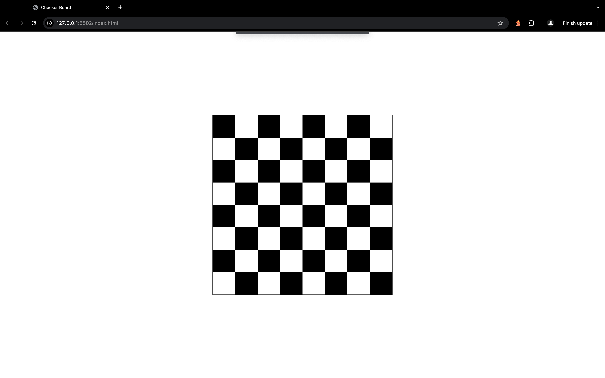

# Checker Board

This web project features a dynamic checkerboard creation tool designed using HTML, CSS, and JavaScript. The project includes three distinct implementations to showcase different approaches to building the checkerboard.

## Features

- Table-Based Implementation: A traditional method using HTML tables to create the checkerboard layout, demonstrating how to utilize table elements for grid-like structures (Found this approach on table-only branch).

- Table-Based Implementation: A traditional method using HTML tables to create the checkerboard layout, demonstrating how to utilize table elements for grid-like structures (Found this approach on grid-only branch).

- JavaScript Generated Checkerboard: An interactive version where the checkerboard is dynamically generated using JavaScript. This approach demonstrates how to manipulate the DOM to create elements on the fly, enhancing user experience and interactivity (Found this approach on js-only branch).

## Technologies

- HTML
- CSS
- JavaScript

## Screenshots

## Deployment

To deploy this project click on the next link

https://johanh0.github.io/Checker-Board/

## 🔗 Links

